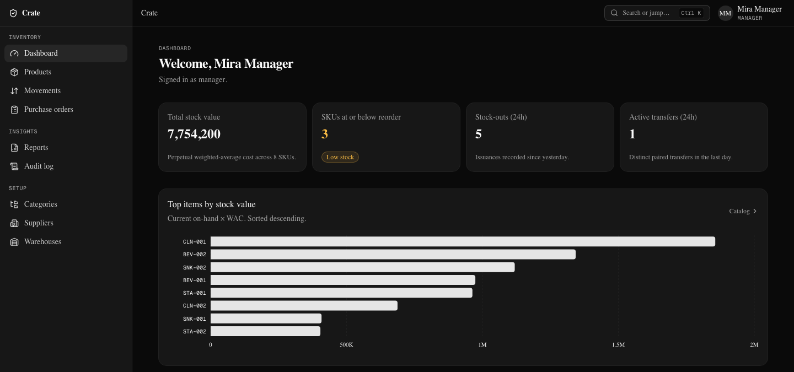
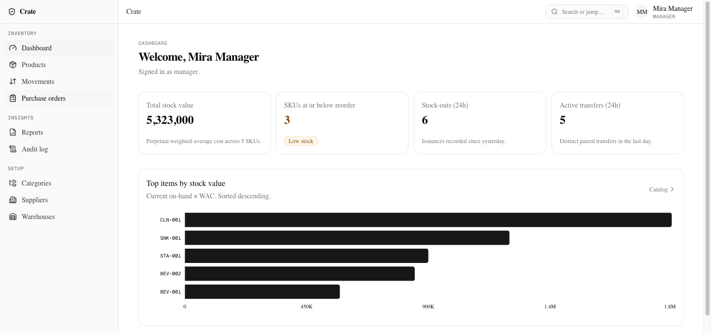
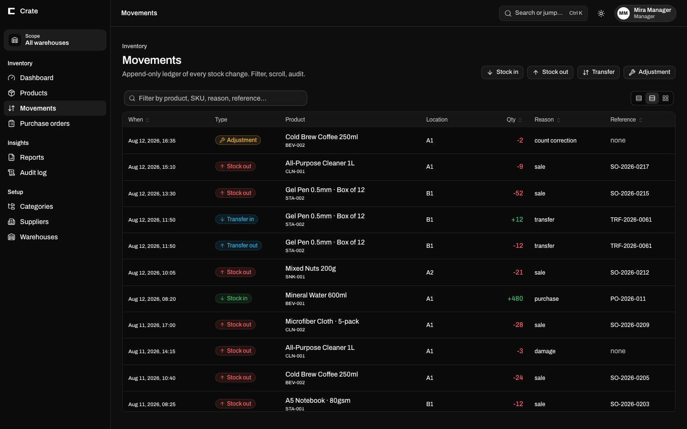
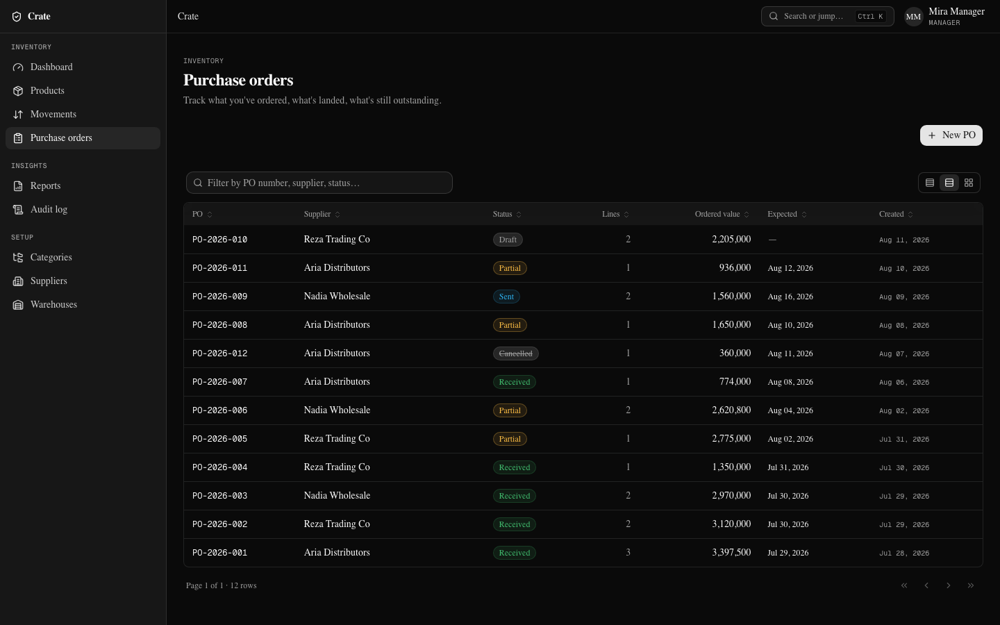
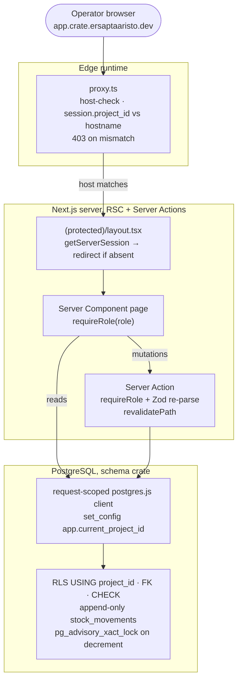

# Crate: Inventory Management System

[](https://github.com/tryea/crate-webapp/actions/workflows/ci.yml)
[](https://github.com/tryea/crate-webapp/actions/workflows/ci.yml)
[](#how-this-repo-is-built)
[](./LICENSE)

A production-grade IMS, not a CRUD toy. Real transactional stock integrity:
append-only movements, atomic two-sided transfers, no negative stock (unless
backorder is explicitly toggled), SQL-level RLS, and a tamper-evident audit log.

**Marketing site:** https://crate.ersaptaaristo.dev &nbsp;·&nbsp; **Live demo:** https://app.crate.ersaptaaristo.dev &nbsp;·&nbsp; both up when probed on 3 September 2026 at 03:02 WIB: marketing site 200, app 307 to `/sign-in`, sign-in page 200 with the login form served. The app is login-gated, so that redirect is the demo working rather than an outage; seeded demo logins are further down this page.

---

## Screenshots

Dashboard: perpetual valuation, reorder signals, and the live movement feed, in both themes.

<table>
  <tr>
    <td width="50%"></td>
    <td width="50%"></td>
  </tr>
</table>

Append-only movement ledger: every stock change, filterable, sortable, audit-ready.



Purchase orders: draft → sent → partial → received state machine:



> Captured from the live demo above, signed in as the manager role, against the
> seeded database: 8 SKUs, 12 purchase orders across all five states, and 55
> movements spread over 15 days. The figures are consistent rather than
> decorative. Every balance is the sum of the ledger, no product ever goes
> negative at any point in the sequence, and the three SKUs flagged at or below
> reorder are flagged because their own sales put them there.

## What's inside

- **Catalog CRUD**: products, categories, suppliers, warehouses + locations. Bulk CSV import (PapaParse + per-row Zod validation + a per-row error report).
- **Inventory core**: Stock In / Out / Transfer (atomic two-sided) / Adjustment. Unit-tested stock math; `pg_advisory_xact_lock` + `checkDecrementAllowed` hold the line under concurrent decrements.
- **Purchase orders**: draft → sent → partial → received state machine. Per-line receive in a single transaction. DB-level CHECK constraints surfaced as field-level UX via sentinel errors.
- **Perpetual weighted-average cost valuation**: unit-tested; the dashboard surfaces the live total.
- **Audit log**: every protected mutation appended in the same transaction as the action. Read-only `/audit` view with a virtualized DataTable + CSV export.
- **Settings**: admin backorder toggle, wired through Stock Out / Transfer / Adjustment in real time.
- **Reports**: stock-on-hand, valuation, and low-stock, all CSV-exportable.
- **i18n**: English + Indonesian, cookie-based locale (no URL prefix), CI-checked message-key parity.

## Architecture

Every mutating request crosses five independent guards before a row is touched:
a proxy host-check, a server session gate, page- and action-level role checks, a
Zod re-parse, and finally SQL-level CHECK / FK / RLS. One bypassed layer never
means data loss.



- **Feature-Sliced Design** under `src/`, enforced by `eslint-plugin-boundaries` with a 7-element direction matrix; lint fails any upward import.
- **Data flow**: React Server Components read; Server Actions mutate and `revalidatePath`. No client query cache to drift.
- **CI grep guardrail**: `scripts/check-auth-guards.sh` fails any `route.ts` / `actions.ts` missing a `requireRole(...)` call. **9 handlers scanned, all guarded.**
- **Two-role Postgres**: `postgres` (superuser, migrations only) + `app_user` (non-superuser, runtime). RLS policies fire on `app_user`; the superuser bypasses by design.

## Stack

- **Runtime:** [Bun](https://bun.sh) 1.3
- **Framework:** [Next.js 16](https://nextjs.org) (App Router · Turbopack · standalone build) · React 19 · TypeScript
- **Architecture:** Feature-Sliced Design under `src/`
- **Data flow:** RSC reads · Server Actions + `revalidatePath` (no client query cache) · React Hook Form + zodResolver (forms) · URL search params (shareable view state)
- **Validation:** Zod 4 (single source of truth for runtime + types)
- **UI:** Tailwind v4 (`@theme` tokens) · shadcn/ui (base-nova / neutral oklch) · lucide-react · Recharts
- **Data grids:** TanStack Table 8 + TanStack Virtual
- **DB:** Postgres 16 · Drizzle ORM · drizzle-zod · drizzle-kit · postgres.js
- **Auth:** [BetterAuth](https://better-auth.com) + Drizzle adapter
- **i18n:** next-intl (cookie locale · en + id)
- **CSV:** PapaParse (RFC 4180)
- **Tests:** Jest 30 (223 unit specs · 13 suites) · Playwright 1.60 (14 E2E specs)

## Quick start (local)

```bash
# 1. A throwaway Postgres 16 (mirrors what CI spins up)
docker run -d --name crate-pg \
  -e POSTGRES_DB=crate -e POSTGRES_USER=postgres -e POSTGRES_PASSWORD=postgres \
  -p 5432:5432 postgres:16-alpine

# 2. Install + configure
bun install
cp .env.example .env.local      # set DATABASE_URL + DATABASE_URL_DIRECT (Postgres 16)

# 3. Schema, policies, seed
bun run db:migrate              # Drizzle migrations (run as a superuser role)
bun run db:rls                  # apply RLS policies + provision app_user
bun run db:seed                 # dev only, refuses if NODE_ENV=production

# 4. Run dev
bun run dev                     # http://localhost:3000
```

Seeded demo logins: `manager@crate.local` / `ChangeMe!Manager` · `admin@crate.local` / `ChangeMe!Admin` · `staff@crate.local` / `ChangeMe!Staff`.

## Quality gates

CI runs the static gates on every PR and the full Playwright suite on `main` + nightly.

```bash
# Static gates, every PR
bun run typecheck               # tsc --noEmit
bun run lint                    # eslint + FSD boundaries
bun run check:auth-guards       # grep-level requireRole check (9 handlers)
bun run check:i18n-parity       # en/id message-key parity
bun run test                    # jest, 223 specs across 13 suites
bun run build                   # production build (standalone)

# E2E: main + nightly, against a Postgres 16 service
bun run test:e2e                # playwright, 14 specs (9 journeys + RBAC + i18n + smoke)

# Local extra (not in CI)
bun run check:concurrency       # advisory-lock decrement stress
```

## How this repo is built

Crate is built by a 5-voice **Council** (Architect, Designer, Engineer, QA, and
Red Team) that deliberates at every `[DECISION]` point and records the verdict
before code is written. Twenty decision records (DEC-001 .. DEC-020) back the
choices in this repo, from the persistence layer through the loading/error states.
Development is issue-driven: every GitHub issue references its parent Decision Record.

Governance docs (the Constitution (`COUNCIL.md`), the phase + decision ledger
(`PROGRESS.md`), per-decision records, deliberation transcripts, design locks, and
deploy guides) live in the project workspace alongside this repo:

- `docs/decisions/`: per-decision records (DEC-001 .. DEC-020)
- `docs/council/`: full deliberation transcripts
- `docs/design/`: UI direction locks · token system · DataTable API
- `docs/phases/`: phase plans + Definition of Done
- `docs/setup/`: Docker + Coolify deploy guides

## License

MIT. See [LICENSE](./LICENSE).
